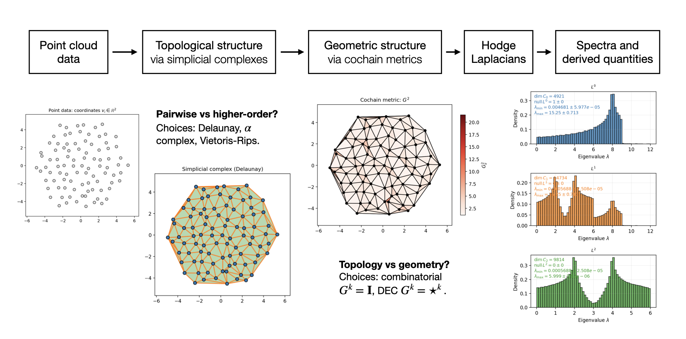
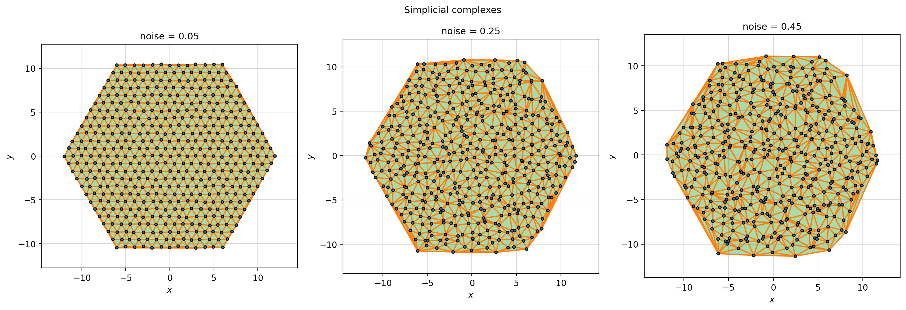
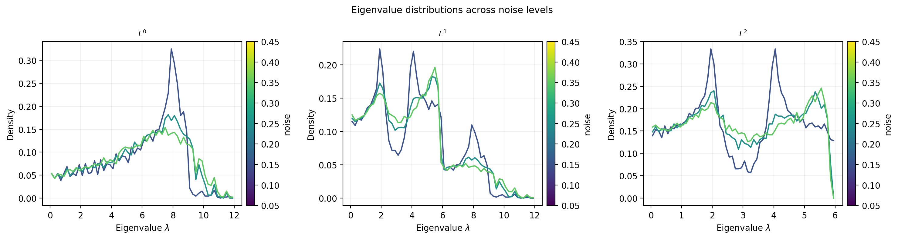

# holspec: Hodge Laplacian spectra for analyzing point cloud data

[](https://github.com/rosalindhuang/holspec/actions/workflows/ci.yml)

`holspec` is a scientific Python framework for studying the structure of point cloud data through simplicial complexes, cochain metrics, and eigenvalue spectra of Hodge Laplacian operators. Starting from point coordinates or pairwise distances, the pipeline builds topological and geometric representations of the data, computes Hodge Laplacians and their spectra, and enables spectral analysis and comparisons across point cloud datasets.

The `holspec` package supports:

- **Point cloud inputs:** Represent point cloud data from coordinates or pairwise distances, including built-in data generation and noisy ensembles.
- **Configurable pipeline stages:** Construct simplicial complexes, assign cochain metrics, assemble Hodge Laplacians, and compute spectra through modular stage configurations.
- **Reproducible workflows:** Run config-driven workflows using the Python API and `holspec` CLI, with persisted intermediate artifacts and provenance tracking.
- **Analysis and visualization:** Analyze, compare, and visualize structural signatures across families of point cloud datasets and modeling choices.

## Motivation

Many datasets can be viewed as collections of points with some notion of proximity, represented by either coordinates or pairwise distances. In these settings, a natural goal is to understand the kinds of structure present in the data, and how those structures change across datasets, parameters, or experimental conditions.

`holspec` is motivated by two structural questions:

- **Pairwise vs. higher-order structure:** Are structural signatures of the point cloud captured at the level of pairs, triples, or larger local groups of points?
- **Topology vs. geometry:** Which structural features are visible from connectivity information alone, and which depend on geometric information such as lengths, areas, volumes, or weights?

The modular pipeline in `holspec` makes these questions computationally accessible. By configuring the pipeline stages, users can choose which local group sizes to represent and what kinds of geometric information to include. The resulting Hodge Laplacian spectra encode these choices as structural signatures that can be analyzed and compared across point cloud datasets.

## Pipeline and architecture

The `holspec` pipeline turns point cloud data into spectral signatures through a sequence of configurable stages.



### Pipeline stages

| Stage            | Framework objects       | Role                                                                                                                                                                                                                                       |
| ---------------- | ----------------------- | ------------------------------------------------------------------------------------------------------------------------------------------------------------------------------------------------------------------------------------------ |
| Point cloud data | `PointData`             | Represent input data as coordinates or pairwise distances. Supports built-in point cloud generators and noisy ensembles.                                                                                                                   |
| Topology         | `SimplicialComplex`     | Establish connectivity by constructing a simplicial complex from the point cloud; determines which higher-order local groups are represented. Options include Delaunay, alpha, and Vietoris-Rips constructions.                            |
| Geometry         | `CochainMetric`         | Incorporate geometric or weighting information by defining an inner product on cochain spaces of the complex. Options include combinatorial and Hodge star metrics; custom cochain metrics can also be constructed through the Python API. |
| Hodge Laplacians | `HodgeLaplacian`        | Construct Hodge Laplacians and other discrete differential operators from the topological and geometric data.                                                                                                                              |
| Spectra          | `HodgeLaplacianSpectra` | Compute eigenvalue spectra and derived spectral quantities for analysis and comparison across datasets.                                                                                                                                    |

### Package structure

The main pipeline stages are implemented as separate subpackages, each with its own framework object, persistence methods, construction routines, and validation utilities. Additional subpackages handle pipeline orchestration, spectral analysis, visualization, and shared infrastructure.

```text
src/holspec/
├── point_data/          # PointData, PointDataEnsemble, point cloud generators
├── simplicial/          # SimplicialComplex, complex construction methods
├── cochain_metric/      # CochainMetric, metric models
├── hodge_laplacian/     # HodgeLaplacian, discrete differential operators
├── spectra/             # HodgeLaplacianSpectra, eigensolvers
├── pipeline/            # Pipeline orchestration and provenance
├── analysis/            # Spectral observables and experiment comparisons
├── visualization/       # Plotting utilities
├── utilities/           # Shared I/O, validation, numerical helpers
└── cli.py               # Command-line interface
```

### Design features

- **Config-driven pipeline execution:** Pipeline runs are specified through YAML configuration files and executed through the Python API or `holspec` CLI. Configurations define input selections, stage options, runtime settings, and output locations.
- **Object persistence and cache loading:** `PointData`, `SimplicialComplex`, and `CochainMetric` can be saved and loaded as standalone HDF5 data objects. `HodgeLaplacian` and `HodgeLaplacianSpectra` persist derived quantities from upstream objects and support cache loading through the pipeline.
- **Provenance tracking:** Pipeline outputs store stage metadata, configuration data, upstream file references, and content hashes. Provenance utilities can trace a downstream file back through prior stages to the input point cloud data.
- **Ensemble-aware workflows:** Point cloud ensembles are represented explicitly through `PointDataEnsemble` and processed member-by-member through the pipeline. Spectral analysis utilities summarize eigenvalue spectra and derived quantities across ensemble members.
- **Directed dependency graph:** The staged pipeline diagram gives the main conceptual flow, while the mathematical dependency structure is a DAG. Pipeline loading utilities resolve upstream dependencies through provenance metadata.

## Installation and usage

### Installation

`holspec` requires Python 3.12 or newer.

For local development, examples, notebook workflows, and visualization, the recommended setup is to create the Conda environment included with the repository and install the package in editable mode:

```bash
git clone https://github.com/rosalindhuang/holspec.git
cd holspec

conda env create -f environment.yml
conda activate holspec

pip install -e .
```

This installs the package and makes the `holspec` command available from the terminal. To confirm the installation, run:

```bash
holspec --help
python -c "import holspec; print(holspec.__version__)"
```

For a lighter setup using an existing Python environment, install the package directly with `pip`:

```bash
pip install -e .
```

Optional dependency groups are available for development, visualization, and notebooks:

```bash
pip install -e ".[dev,viz,notebook]"
```

### Usage interfaces

`holspec` can be used through two interfaces:

| Interface  | Use it for                                                                                                      | Examples                                                                                                           |
| ---------- | --------------------------------------------------------------------------------------------------------------- | ------------------------------------------------------------------------------------------------------------------ |
| CLI        | Running reproducible data generation and pipeline workflows from YAML configuration files.                      | `holspec run`, `holspec generate-data`                                                                             |
| Python API | Analyzing and visualizing pipeline outputs, working directly with framework objects, building custom workflows. | `load_spectra`, `EnsembleSpectraAnalysis`, `PointData`, `SimplicialComplex`, `run_pipeline`, `run_data_generation` |

The two interfaces are complementary and cover different needs. Typical workflows can combine them: run reproducible computations from the CLI, then use the Python API for interactive exploration, analysis, and visualization. See the **Quickstart** section for an example.

The CLI is the main interface for running config-driven workflows.

- `holspec run <pipeline_config.yml>`: Run the full pipeline from a YAML config.
- `holspec generate-data <data_generation_config.yml>`: Generate point cloud data from a YAML config.
- `holspec inspect <output_file.h5>`: Optionally inspect an HDF5 output file.

Use `holspec --help` or `holspec <command> --help` to see available options.

The top-level Python API exposes the framework objects, pipeline entry points, and analysis utilities. Visualization utilities and lower-level construction, validation, and I/O helpers are available from the corresponding subpackages, including `holspec.visualization`, `holspec.simplicial`, `holspec.cochain_metric`, and `holspec.utilities`.

## Quickstart

The quickstart notebook is a small demo of the kinds of structural studies that the end-to-end `holspec` workflow can support. It starts from an ordered point cloud and asks: what happens to the spectral signatures of structure as noise is added?

### Running the example

The notebook is found at `examples/quickstart.ipynb`. It walks through the full workflow:

1. Generates point cloud ensembles at several noise levels.
2. Runs the `holspec` pipeline on each ensemble.
3. Analyzes their Hodge Laplacian spectra.
4. Visualizes the structures and eigenvalue distributions.

The parameters near the top of the notebook make it easy to explore different lattice sizes, noise levels, or pipeline settings. The notebook automatically writes YAML configs based on these choices, which can also be run from the CLI:

```bash
holspec generate-data examples/configs/data_generation_quickstart.yml
holspec run examples/configs/pipeline_quickstart.yml
```

The quickstart artifacts are written under `examples/`: generated configs, point cloud data, pipeline results, and visualizations.

### Example outputs



Adding noise changes which nearby points connect, reshaping the simplicial complex.



The eigenvalue spectra respond to these structural changes: the distributions shift, sharp peaks spread out, and the curves become less regular as noise increases.

## Tests and verification

`holspec` includes a `pytest` suite covering the mathematical core, object persistence, pipeline execution, analysis utilities, and public interfaces.

After installing the development dependencies, run:

```bash
pytest
```

The test suite includes:

- **Mathematical and numerical checks:** Small hand-checkable examples to verify simplicial complex invariants, cochain metric behavior, Hodge Laplacian operator identities, eigensolver behavior, and spectra on known examples.
- **Object contracts and validation:** Tests covering construction, access methods, validation behavior, and error handling for framework objects.
- **Persistence and provenance:** HDF5 round-trip tests to verify framework objects can be saved, loaded, and cache-loaded consistently, with content-hash mismatch detection and provenance-based pipeline loading.
- **Pipeline and interfaces:** End-to-end and staged pipeline execution, top-level Python API, CLI workflows, and config-driven data generation.

## Future directions

`holspec` is focused on Hodge Laplacian spectral analysis of point cloud data, with an emphasis on modular pipeline construction, reproducible computation, and analyzing spectral signatures across datasets and modeling choices.

The current framework opens several natural directions for further work:

- **Structural transitions:** Study how spectral signatures change across noise levels, length scale parameters, simplicial constructions, and metric models, particularly how these choices interact.
- **Physical and biological applications:** Apply the framework to soft/active matter and biological systems exhibiting disorder, collective behavior, or phase transitions. In these settings, spectral signatures can help characterize structural changes across conditions and enable cross-system comparisons.
- **Spectral features for downstream analysis:** Explore the use of Hodge Laplacian spectra and derived spectral quantities as features for classification, clustering, regression, or other data analysis workflows.
